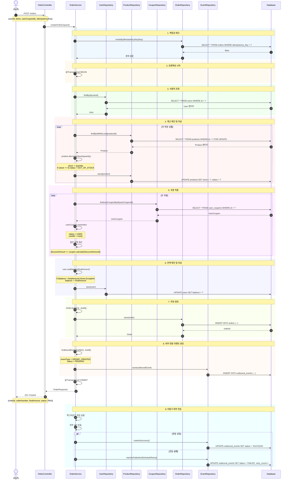
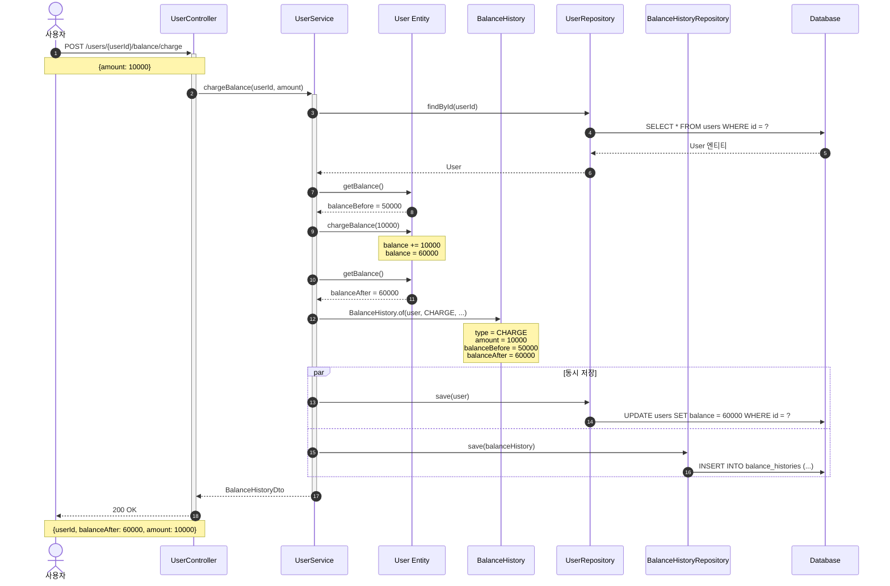
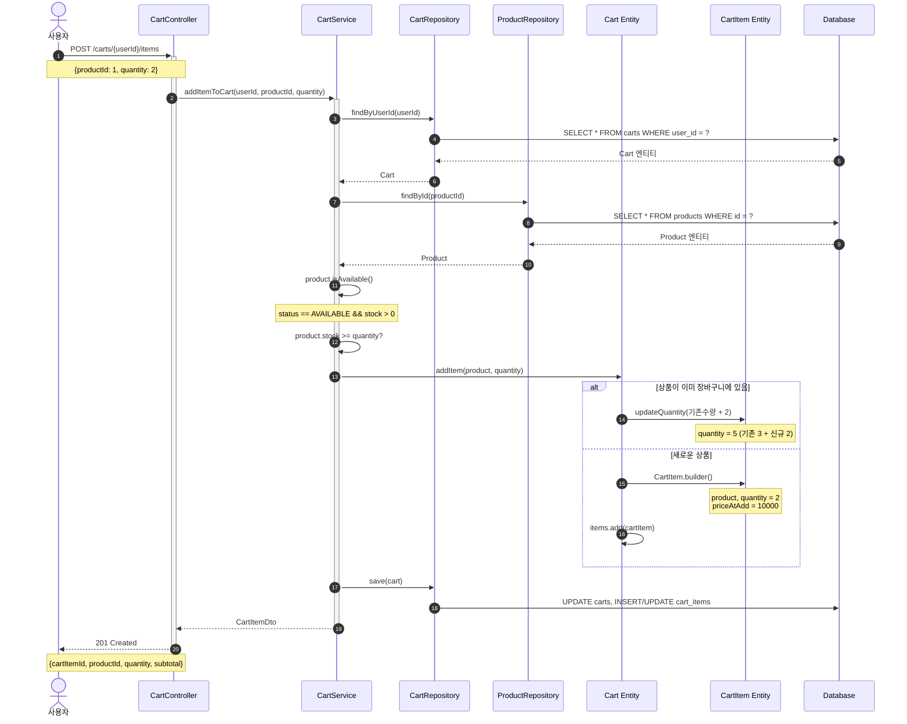
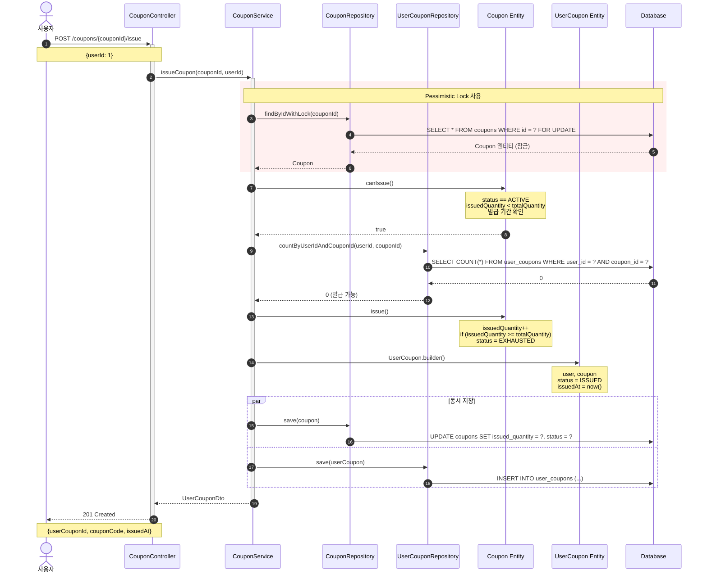
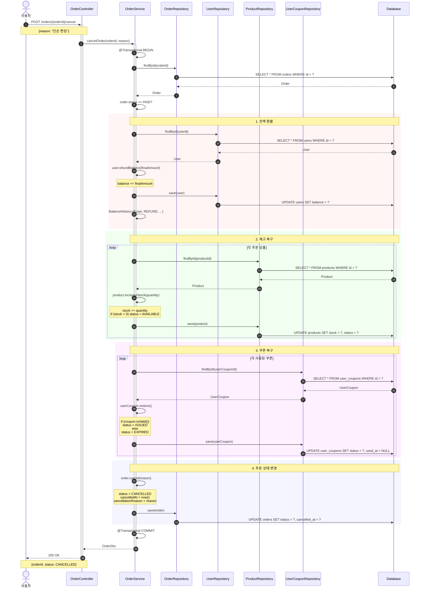
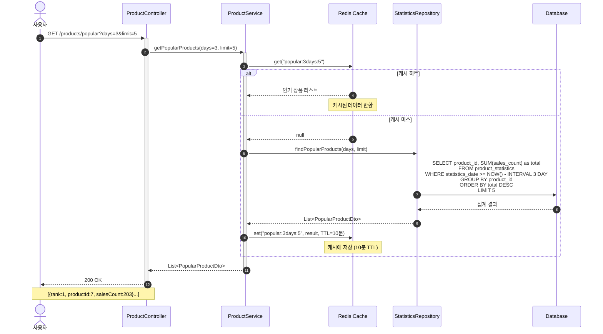
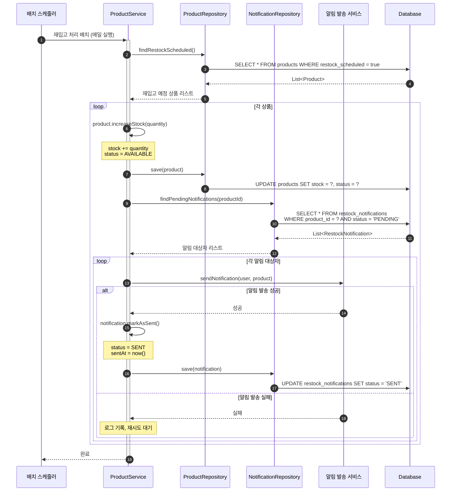

# E-Commerce 시퀀스 다이어그램 (Mermaid)

> **이 파일을 https://mermaid.live 에서 시각화할 수 있습니다**

---

## 📋 목차

1. [주문 생성 및 결제](#1-주문-생성-및-결제)
2. [잔액 충전](#2-잔액-충전)
3. [장바구니에 상품 추가](#3-장바구니에-상품-추가)
4. [쿠폰 발급](#4-쿠폰-발급)
5. [주문 취소 및 환불](#5-주문-취소-및-환불)
6. [인기 상품 조회](#6-인기-상품-조회)
7. [재입고 알림](#7-재입고-알림)

---

## 1. 주문 생성 및 결제

### 전체 플로우



---

## 2. 잔액 충전



---

## 3. 장바구니에 상품 추가



---

## 4. 쿠폰 발급



---

## 5. 주문 취소 및 환불



---

## 6. 인기 상품 조회



---

## 7. 재입고 알림



---

## 🎨 다이어그램 사용 방법

### 1. Mermaid Live Editor
- https://mermaid.live 접속
- 위의 코드 블록 복사
- 에디터에 붙여넣기
- 실시간 미리보기 확인

### 2. GitHub/GitLab
- README나 이슈에 직접 붙여넣기
- 자동으로 렌더링됨

### 3. VS Code
- Mermaid 플러그인 설치
- Markdown Preview 사용

### 4. 문서 도구
- Notion: Mermaid 블록 지원
- Confluence: Mermaid 매크로 사용
- Obsidian: 기본 지원

---

## 📊 다이어그램 색상 의미

| 색상 | 의미 |
|------|------|
| 🔵 파란색 (rgb(240, 248, 255)) | 검증/체크 단계 |
| 🟡 노란색 (rgb(255, 250, 240)) | 트랜잭션 경계 |
| 🟢 초록색 (rgb(240, 255, 240)) | 조회 작업 |
| 🔴 빨간색 (rgb(255, 245, 245)) | 중요 비즈니스 로직 |
| 🟣 보라색 (rgb(255, 240, 255)) | 쿠폰/할인 관련 |
| 🔵 하늘색 (rgb(245, 245, 255)) | 결제/금액 관련 |
| 🟢 연두색 (rgb(250, 255, 240)) | 생성 작업 |
| 🟠 주황색 (rgb(255, 250, 245)) | 비동기/이벤트 |
| 🔵 청록색 (rgb(240, 255, 255)) | 외부 연동 |

---

## 🔧 커스터마이징

### 스타일 변경

```mermaid
%%{init: {'theme':'forest', 'themeVariables': { 'primaryColor':'#ff6666'}}}%%
sequenceDiagram
    ...
```

### 테마 옵션
- `default`: 기본 테마
- `forest`: 초록색 계열
- `dark`: 다크 모드
- `neutral`: 중립적인 색상

---

**Last Updated**: 2025-10-31
